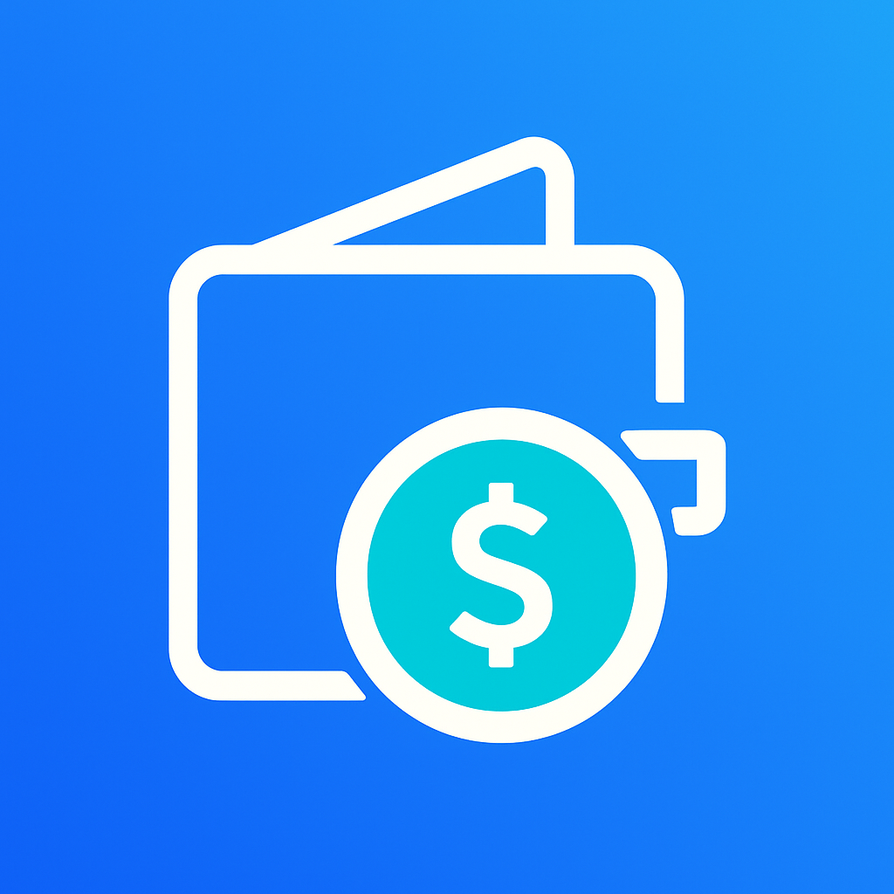

# Money Manager

A simple, elegant financial tracking app for managing personal finances on the go. This lightweight web application helps you track your balances across multiple accounts and manage your income and expenses with ease.

## Features

- **Multiple Account Tracking**: Monitor balances across Credit Union, Revolut, and Cash accounts
- **Transaction Management**: Record income and expenses with descriptions and dates
- **Location Tracking**: Automatically capture location data for each transaction (with permission)
- **Interactive Maps**: View transaction locations on an interactive map
- **Responsive Design**: Works on mobile and desktop devices
- **Offline Capability**: Add to your home screen for an app-like experience
- **Local Storage**: All data is stored locally on your device for privacy

## Getting Started

### Usage

1. Open the application in a web browser
2. View your current account balances at the top
3. Add transactions using the "Add Transaction" button
4. Fill in transaction details (amount, account, type, description, date)
5. View transaction history in the list below
6. Tap on any transaction to view details and location
7. Delete transactions from the details view if needed

### Installation on iOS

For the best experience on iOS devices:

1. Open the app in Safari
2. Tap the Share button (box with arrow)
3. Select "Add to Home Screen"
4. Tap "Add"

The app will now appear on your home screen with an icon, and will open in full-screen mode when launched.

## Data Management

- **Data Privacy**: All data is stored locally on your device using the browser's localStorage
- **Data Reset**: Use the reset button in the header to clear all data if needed
- **Backup**: Currently no cloud backup is available - data is device-specific

## Technical Details

Money Manager is a progressive web application built with:

- Vanilla JavaScript (no frameworks)
- HTML5 and CSS3
- Leaflet.js for map visualization
- Font Awesome for iconography
- Local Storage API for data persistence

The application does not require any server-side components and can be hosted on any static web server.

## License

This project is available for personal use.

## Credits

- Maps powered by Leaflet and OpenStreetMap
- Icons provided by Font Awesome